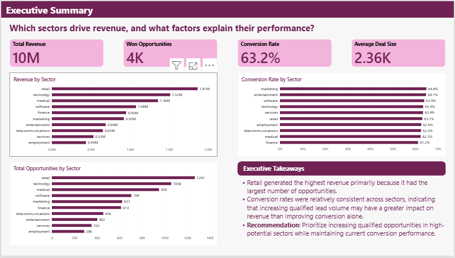
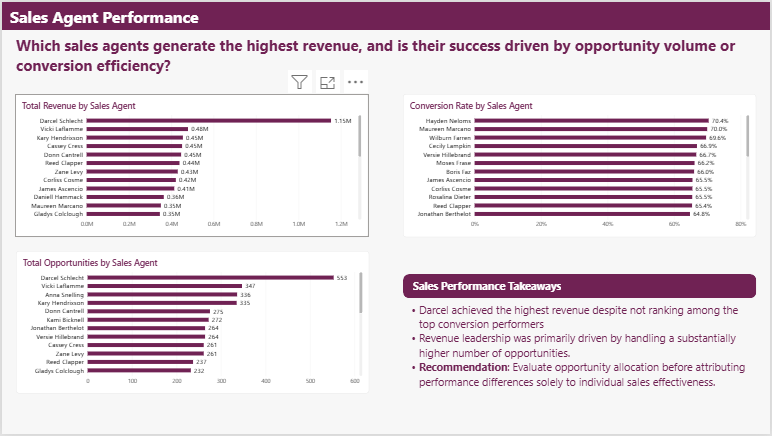
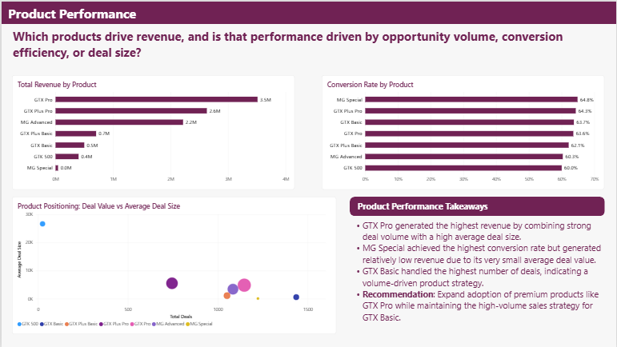

# 📊 Sales Pipeline Analytics Dashboard

An end-to-end business analytics project using **SQL**, **Excel**, and **Power BI** to analyze **6,711 B2B sales opportunities**, identify key revenue drivers, evaluate sales performance, and deliver data-driven recommendations for business decision-making.

---

# Business Problem

A B2B sales organization generates thousands of sales opportunities across multiple sectors, products, and sales representatives. While revenue is a key performance metric, leadership also needs to understand the factors driving that performance.

This project analyzes the sales pipeline to answer critical business questions such as:

- Which sectors contribute the most to revenue?
- Are top-performing sales agents succeeding because of higher conversion rates or greater opportunity volume?
- Which products generate the highest business value, and is their performance driven by deal size, conversion efficiency, or sales volume?

The objective is to transform raw sales data into actionable insights that support strategic decision-making and resource allocation.

---

# Project Objectives

The analysis was designed to answer key business questions using a structured analytics workflow:

- Validate and assess the quality of the sales data.
- Measure overall sales pipeline performance using key business KPIs.
- Identify the sectors contributing the most to revenue and opportunities.
- Evaluate sales agent performance using revenue, conversion rate, and opportunity volume.
- Analyze product performance to understand the drivers of revenue and deal value.
- Develop an interactive Power BI dashboard to communicate insights and support executive decision-making.

---

# Dataset Overview

The project uses a B2B sales pipeline dataset containing **6,711 sales opportunities** across multiple industries, products, and sales teams.

The analysis combines information from four related tables:

| Table | Description |
|-------|-------------|
| **Accounts** | Customer account information, including industry sector and account details. |
| **Products** | Product catalog with product names and related information. |
| **Sales Pipeline** | Opportunity-level sales data including deal stage, revenue, close date, and assigned product. |
| **Sales Teams** | Sales representative and manager information used to evaluate team performance. |

These tables were integrated to analyze sales performance from multiple business perspectives, including sectors, products, and sales agents.

---

# Project Workflow

The project followed a structured business analytics workflow:

```text
Raw Sales Data
        │
        ▼
Data Validation & Quality Checks (SQL)
        │
        ▼
Exploratory Data Analysis
        │
        ▼
Business Analysis
(Sector • Sales Agent • Product)
        │
        ▼
KPI Development
        │
        ▼
Interactive Power BI Dashboard
        │
        ▼
Business Insights & Recommendations
```

This approach ensured that business recommendations were supported by validated data, structured analysis, and interactive visualizations.

---

# Methodology

The project was completed using a structured analytics approach, with each tool serving a specific purpose in the workflow.

| Tool | Purpose |
|------|---------|
| **Excel** | Initial dataset exploration and familiarization with the data structure. |
| **MySQL** | Data validation, exploratory data analysis, KPI calculations, and business analysis using SQL. |
| **Power BI** | Development of an interactive executive dashboard to visualize key performance indicators and communicate business insights. |
| **Git & GitHub** | Version control, project documentation, and portfolio presentation. |

### SQL Techniques Used

- Data Validation
- Data Cleaning
- Aggregate Functions
- Conditional Aggregation
- CASE Statements
- Common Table Expressions (CTEs)
- GROUP BY & ORDER BY
- Business KPI Calculations

---

# Dashboard Overview

The Power BI dashboard was designed to answer key business questions through three focused report pages. Each page explores a different aspect of sales performance and concludes with business insights and recommendations.

## 1. Executive Summary

**Business Question**

> Which sectors drive revenue, and what factors explain their performance?

**Key Visuals**

- Revenue by Sector
- Conversion Rate by Sector
- Total Opportunities by Sector
- Executive KPI Cards
- Executive Takeaways

**Purpose**

Provide leadership with a high-level overview of sales performance and identify the sectors contributing most to business growth.

---

## 2. Sales Agent Performance

**Business Question**

> Which sales agents generate the highest revenue, and is their success driven by opportunity volume or conversion efficiency?

**Key Visuals**

- Revenue by Sales Agent
- Conversion Rate by Sales Agent
- Total Opportunities by Sales Agent
- Sales Performance Takeaways

**Purpose**

Evaluate individual sales performance and determine whether revenue leadership is driven by sales effectiveness or opportunity allocation.

---

## 3. Product Performance

**Business Question**

> Which products drive revenue, and is that performance driven by opportunity volume, conversion efficiency, or deal size?

**Key Visuals**

- Revenue by Product
- Conversion Rate by Product
- Product Positioning Scatter Plot
- Product Performance Takeaways

**Purpose**

Identify the products that contribute most to revenue and understand the factors driving their performance.

---

# Dashboard Preview

## 1. Executive Summary



---

## 2. Sales Agent Performance



---

## 3. Product Performance



---

# Key Business Insights

### Executive Summary

- Retail generated the highest revenue, primarily due to the largest opportunity volume.
- Conversion rates remained relatively consistent across sectors (61–65%), indicating that increasing qualified opportunities may have a greater impact on revenue than improving conversion efficiency alone.

### Sales Agent Performance

- The highest revenue-generating sales agent was not the top conversion performer.
- Revenue leadership was primarily driven by managing a larger volume of sales opportunities.
- Sales performance should be evaluated alongside opportunity allocation rather than conversion rate alone.

### Product Performance

- GTX Pro generated the highest revenue by combining strong opportunity volume with a high average deal size.
- MG Special achieved the highest conversion rate but generated comparatively lower revenue due to smaller deal values.
- Product performance varied across revenue, conversion, and deal value, highlighting different product sales strategies.

---

# Business Recommendations

Based on the analysis, the following actions could improve sales performance:

- Increase qualified opportunity generation in high-performing sectors to maximize revenue growth.
- Review opportunity allocation across sales agents to ensure fair performance evaluation and identify coaching opportunities.
- Expand adoption of premium products such as GTX Pro while maintaining the high-volume sales strategy of GTX Basic.
- Continue monitoring conversion rates alongside opportunity volume to identify the most effective growth strategies.

---

# Skills Demonstrated

### Business Analytics
- KPI Development
- Business Performance Analysis
- Executive Reporting
- Data-Driven Decision Making

### SQL
- Data Validation
- Exploratory Data Analysis (EDA)
- Conditional Aggregation
- CASE Statements
- Common Table Expressions (CTEs)
- Business KPI Calculations

### Power BI
- Interactive Dashboard Design
- Data Visualization
- Business Storytelling
- Executive Dashboard Development

### Tools
- MySQL
- Power BI
- Excel
- Git
- GitHub

---

# Conclusion

This project demonstrates an end-to-end business analytics workflow—from validating raw sales data and performing SQL-based analysis to designing an executive Power BI dashboard that translates data into actionable business insights and strategic recommendations.
